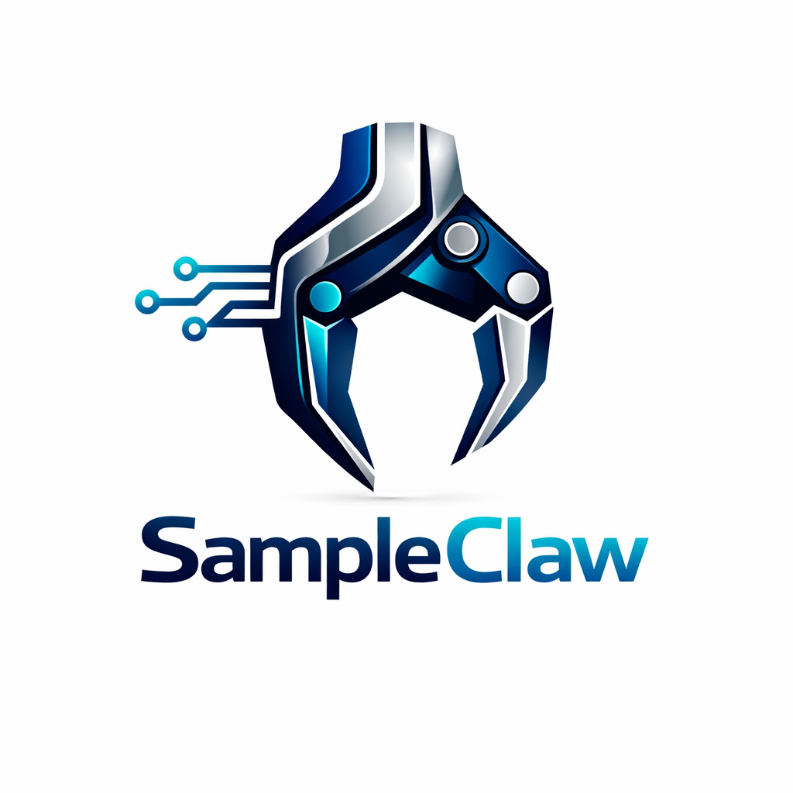

#  SampleClaw

[](https://www.python.org/)
[](LICENSE)
[](https://github.com/aizenklyian-sys/SampleClaw/stargazers)

**SampleClaw** is a powerful, production-ready autonomous AI agent framework designed for speed, safety, and extreme ease of use. It empowers developers to build intelligent agents that can plan, act, and learn from their environment with minimal boilerplate.

## ✨ Features & Highlights

SampleClaw is built from the ground up to be the **fastest** and **easiest to use** agent framework available. It improves upon existing solutions by offering:

-   ⚡ **Lightning Fast**: Optimized core loop with `asyncio` for non-blocking operations, ensuring rapid execution and responsiveness.
-   🛡️ **Production-Ready Safety**: Built-in safety mechanisms, configurable guardrails, and robust error recovery for secure and reliable agent deployment.
-   🎯 **Extreme Simplicity**: Create a fully functional autonomous agent in just a few lines of code, abstracting away complexity.
-   🧩 **Highly Extensible**: A modular skills and tools system that allows seamless integration of custom functionalities and external APIs.
-   🧠 **Comprehensive Memory**: Integrated dual-layered memory (short-term context & long-term knowledge) for persistent learning and informed decision-making.
-   🔄 **Self-Reflection & Recovery**: Agents can analyze their performance, diagnose failures, and automatically re-plan to achieve goals.

## 🏗️ Architecture Overview

SampleClaw follows a sophisticated **Plan-Act-Observe** cycle, orchestrated by a central Agentic Loop. This design ensures that agents can intelligently process information, make decisions, execute actions, and learn from outcomes.


### Core Components:
-   **Agentic Loop**: The central orchestrator, managing the continuous cycle of planning, acting, and observing.
-   **Skills System**: A flexible plugin architecture for defining and managing the agent's capabilities (e.g., web search, code execution, file operations).
-   **Memory**: Comprises both short-term (contextual) and long-term (knowledge base) memory for comprehensive information retention.
-   **Safety Mechanisms**: Enforces ethical and secure operation through pre-action checks, content moderation, and human oversight points.
-   **Self-Reflection & Error Recovery**: Enables the agent to evaluate its performance, identify issues, and adapt its strategy to overcome challenges.

## 🚀 Quick Start

Get your first SampleClaw agent up and running in minutes!

### Installation

Install SampleClaw directly from GitHub (PyPI coming soon!):
```bash
pip install git+https://github.com/aizenklyian-sys/SampleClaw.git
```

### Example Usage

Create a simple agent that researches and summarizes information:

```python
import asyncio
from sampleclaw import AgentFactory

async def main():
    # Create an agent with default skills (web search, code execution, etc.)
    agent = AgentFactory.create_default_agent(
        name="ClawBot",
        goal="research the latest trends in AI agents and save a summary to trends.txt"
    )

    # Run the agent autonomously
    print(f"--- Starting Agent: {agent.name} ---")
    status = await agent.run()
    print(f"--- Agent {agent.name} finished with status: {status} ---")

if __name__ == "__main__":
    asyncio.run(main())
```

## 📚 Documentation

For detailed guides, API references, and advanced usage examples, please visit our [Documentation](docs/README.md).

## 🤝 Contributing

We welcome contributions! Please see our [Contributing Guidelines](CONTRIBUTING.md) for more information.

## 📜 License

SampleClaw is released under the [MIT License](LICENSE).

---
*Built with ❤️ by aizenklyian-sys.*
