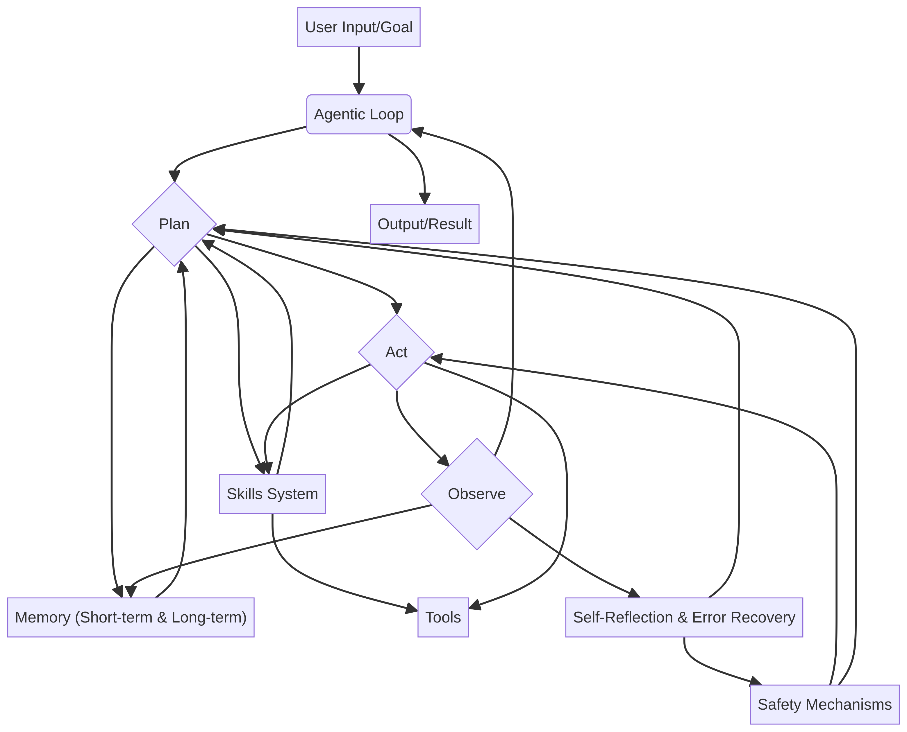

# SampleClaw Documentation

Welcome to the SampleClaw documentation! This guide will help you understand the architecture, components, and usage of the SampleClaw AI agent framework.

## Table of Contents

1. [Architecture Overview](#architecture-overview)
2. [Core Components](#core-components)
   - [Agentic Loop](#agentic-loop)
   - [Memory Systems](#memory-systems)
   - [Skills System](#skills-system)
   - [Safety Mechanisms](#safety-mechanisms)
3. [Getting Started](#getting-started)
4. [Advanced Usage](#advanced-usage)
   - [Custom Skills](#custom-skills)
   - [Custom Memory](#custom-memory)
   - [Safety Guardrails](#safety-guardrails)
5. [API Reference](#api-reference)

## Architecture Overview

SampleClaw is built on a modular, asynchronous architecture designed for high performance and extensibility. The central component is the **Agentic Loop**, which orchestrates the interaction between memory, skills, and safety mechanisms.



## Core Components

### Agentic Loop

The Agentic Loop follows a **Plan-Act-Observe** cycle:
- **Plan**: The agent analyzes its goal, current context (short-term memory), and available skills to formulate a multi-step plan.
- **Act**: The agent executes each step of the plan using its registered skills and tools.
- **Observe**: After each action, the agent observes the outcome, updating its memory and evaluating its progress.

### Memory Systems

SampleClaw features a dual-layered memory system:
- **Short-Term Memory**: Stores recent interactions and observations to maintain context during a single session.
- **Long-Term Memory**: Persistently stores learned knowledge and past experiences to improve performance over time.

### Skills System

The skills system is a modular plugin architecture that allows developers to easily extend the agent's capabilities. A skill is simply a Python function with a name and description, registered with the `SkillManager`.

### Safety Mechanisms

SampleClaw includes built-in safety guardrails to ensure secure and ethical operation. These mechanisms perform pre-action and post-action checks, allowing for:
- **Forbidden Actions**: Preventing the agent from executing specific skills.
- **Action Validation**: Checking parameters for dangerous keywords or patterns (e.g., preventing harmful shell commands).
- **Result Redaction**: Flagging or redacting sensitive information in action outcomes.

## Getting Started

To get started with SampleClaw, follow the [Quick Start guide in the main README](../README.md#quick-start).

## Advanced Usage

### Custom Skills

You can easily add your own custom skills to SampleClaw:

```python
from sampleclaw.skills.skill_manager import SkillManager

def my_custom_skill(param1: str, param2: int):
    """Description of what my skill does."""
    # Your skill logic here
    return {"result": f"Executed with {param1} and {param2}"}

sm = SkillManager()
sm.register_skill("my_skill", "My custom skill description", my_custom_skill)
```

### Safety Guardrails

Configure custom safety policies:

```python
from sampleclaw.safety.safety_mechanisms import SafetyMechanisms

safety = SafetyMechanisms(forbidden_actions=["delete_database", "shutdown_system"])
# The agent will now be blocked from executing these actions.
```

## API Reference

(Detailed API reference coming soon...)
